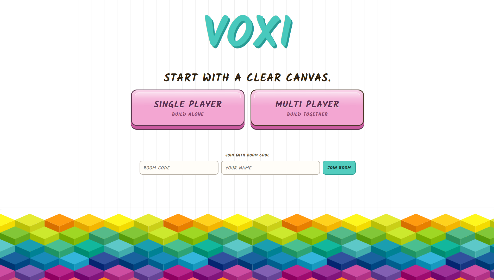

<div align="center">

# Arnab Jena — Portfolio

**A collection of interactive tools, visual stories, and real-time experiences.**

[](https://arnabjena007.github.io/)
[](https://github.com/arnabjena007)
[](https://nextjs.org/)
[](https://www.typescriptlang.org/)

</div>

## Projects

| Project | What it is | Stack | Links |
| --- | --- | --- | --- |
| [Pixlate](#pixlate) | Fast pixel-art generation | Go | [Live](https://pixlate-devo.vercel.app/) · [Code](https://github.com/arnabjena007/Pixlate) |
| [In.decoded](#indecoded) | Interactive data story on India’s delimitation debate | SvelteKit · D3 · Scrollama | [Live](https://indicoded.vercel.app/) · [Code](https://github.com/arnabjena007/indi.coded-website) |
| [GitMap](#gitmap) | Customizable contribution heatmaps for React | React · TypeScript | [Live](https://gitmap-devo.vercel.app/) · [Code](https://github.com/arnabjena007/gitmap) |
| [VOXI](#voxi) | Real-time voxel building rooms | TypeScript · Three.js · Rust | [Live](https://voxi-devo.vercel.app/) · [Code](https://github.com/arnabjena007/voxi) |
| [Colora](#colora) | Browser-first PDF annotation workspace | Next.js · TypeScript · PDF.js | [Live](https://colora-devo.vercel.app/) · [Code](https://github.com/arnabjena007/Colora) |
| [Scrum](#scrum) | Cross-platform task and sprint management | React · Vite · Supabase | [Live](https://scrum-devo.vercel.app/) · [Code](https://github.com/arnabjena007/Scrum) |
| [APEX](#apex) | Student collaboration community | Next.js · Firebase | [Live](https://apex-mit.vercel.app/) · [Code](https://github.com/arnabjena007/Apex-MITB) |
| [Mapify](#mapify) | Kolkata shortest-path explorer | React · Leaflet · Dijkstra | [Live](https://mapify-devo.vercel.app/) · [Code](https://github.com/arnabjena007/Mapify) |
| [Nehru](#nehru) | Cinematic historical Q&A experience | React · Vite · Gemini | [Live](https://nehru-devo.vercel.app/) · [Code](https://github.com/arnabjena007/Nehru) |

---

## Pixlate

> Turn photos into abstract pixel art — quickly, predictably, and from the command line.

[](https://pixlate-devo.vercel.app/)

Pixlate is a Go-based image transformation CLI that turns regular images into pixel-art compositions. Its parallel processing pipeline makes it practical to generate high-resolution output and multiple variations without a graphical editor.

**Highlights**

- Parallel image processing with goroutines
- High-resolution input support and configurable output dimensions
- Sweep mode, seeded randomness, colour sorting, and variations
- Scriptable command-line workflow

[](https://pixlate-devo.vercel.app/) [](https://github.com/arnabjena007/Pixlate)

**Video walkthrough**

https://github.com/user-attachments/assets/3f3885c3-b7c4-4240-9bb9-1df03461941f

---

## In.decoded

> A visual data story about India’s delimitation debate.

[](https://indicoded.vercel.app/)

In.decoded uses scroll-driven maps and charts to examine population, representation, fertility, GDP, tax transfers, and literacy in the context of India’s delimitation debate. The experience blends narrative pacing with interactive data visualization.

**Highlights**

- Seven-plus interactive maps and charts
- Scroll-driven cartograms and animated state-level comparisons
- Narrative-first exploration of policy and representation data
- Built with SvelteKit, D3.js, Scrollama, and GeoJSON

[](https://indicoded.vercel.app/) [](https://github.com/arnabjena007/indi.coded-website)

**Interactive demo**: [explore the story live →](https://indicoded.vercel.app/)

---

## GitMap

> Beautiful, themeable GitHub-style contribution heatmaps for React.

[](https://gitmap-devo.vercel.app/)

GitMap is a reusable React component library for presenting GitHub activity as a polished, interactive heatmap. It is designed to drop cleanly into profiles, dashboards, and developer tools.

**Highlights**

- Ten-plus built-in themes, including GitHub, Cyberpunk, and Lavender
- Control cell size, gap, shape, gradients, and custom CSS
- Framer Motion-powered animation and tooltips
- Live data through the public GitHub API

[](https://gitmap-devo.vercel.app/) [](https://github.com/arnabjena007/gitmap)

**Interactive demo**: [try the component playground →](https://gitmap-devo.vercel.app/)

---

## VOXI

> A real-time collaborative voxel room for building together.

[](https://voxi-devo.vercel.app/)

VOXI lets people create or join rooms, place textured voxel blocks on a shared 3D canvas, chat in real time, and optionally connect through voice chat. Every multiplayer room runs as an authoritative Tokio actor, keeping shared state responsive and in sync.

**Highlights**

- Shared voxel canvas with live placement and removal updates
- Solo and multiplayer rooms with six-character room codes
- Materials, landscapes, build presets, chat, and player presence
- Optional LiveKit voice chat, plus keyboard undo and redo

[](https://voxi-devo.vercel.app/) [](https://github.com/arnabjena007/voxi)

**Video walkthrough**

https://github.com/user-attachments/assets/2994b89c-9783-4a11-8283-f9b92d379bed

---

## Colora

> A calm, browser-first PDF annotation workspace.

[](https://colora-devo.vercel.app/)

Colora is a polished editor for working with PDFs and images. It combines a selectable text layer, freeform canvas annotation, recent-work recovery, and high-quality PDF export in a focused interface.

**Highlights**

- Open PDFs and images or create blank projects
- Highlight, draw, add text, notes, shapes, signatures, and pictures
- Select, move, resize, edit, and delete annotations
- Local autosave, optional Google Drive backup, and PDF export

[](https://colora-devo.vercel.app/) [](https://github.com/arnabjena007/Colora)

**Video walkthrough**

https://github.com/user-attachments/assets/c21dbb6c-9ea2-4ffe-ab8b-2e262e1f3257

---

## Scrum

> A straightforward workspace for planning sprints and moving work forward.

[](https://scrum-devo.vercel.app/)

Scrum is a task-management product with board, dashboard, and timeline views. The monorepo includes web, mobile, and desktop clients so teams can use the same workflow across devices.

**Highlights**

- Create and manage tasks, assignees, priorities, tags, and comments
- Kanban board, dashboard, and timeline views
- React web app, Expo mobile app, and Electron desktop app
- Supabase authentication and a Hono/Drizzle-backed API

[](https://scrum-devo.vercel.app/) [](https://github.com/arnabjena007/Scrum)

**Interactive demo**: [open the workspace →](https://scrum-devo.vercel.app/)

---

## APEX

> Bridging technical skills and visionary ideas through student collaboration.

[](https://apex-mit.vercel.app/)

APEX is a community platform that helps technical and non-technical students share ideas, discover projects, form teams, and turn early concepts into real work.

**Highlights**

- Community-first project and idea discovery
- Cross-discipline collaboration workflows
- Accessible onboarding for new contributors
- Firebase-backed application data

[](https://apex-mit.vercel.app/) [](https://github.com/arnabjena007/Apex-MITB)

**Interactive demo**: [visit APEX →](https://apex-mit.vercel.app/)

---

## Mapify

> Find and visualize shortest paths across Kolkata.

[](https://mapify-devo.vercel.app/)

Mapify makes Dijkstra’s shortest-path algorithm approachable through a map-first interface. Choose locations by typing, selecting landmarks, entering coordinates, or clicking the map, then inspect the resulting route and metrics.

**Highlights**

- Leaflet map with OpenStreetMap tiles
- Real-time Dijkstra path visualization
- Text, landmark, map-click, and coordinate inputs
- Route distance, segment count, and computation-time metrics

[](https://mapify-devo.vercel.app/) [](https://github.com/arnabjena007/Mapify)

**Interactive demo**: [plan a route →](https://mapify-devo.vercel.app/)

---

## Nehru

> A cinematic journey through *The Discovery of India*.

[](https://nehru-devo.vercel.app/)

Nehru is an immersive narrative experience inspired by Jawaharlal Nehru’s *The Discovery of India*. It combines cinematic transitions, ambient audio, an AI-powered historical Q&A interface, and browser-native speech synthesis.

**Highlights**

- Guided multi-scene narrative with visual storytelling
- AI persona grounded in the book’s context and philosophy
- Suggested topics and open-ended historical Q&A
- Text-to-speech responses and responsive design

[](https://nehru-devo.vercel.app/) [](https://github.com/arnabjena007/Nehru)

**Interactive demo**: [begin the experience →](https://nehru-devo.vercel.app/)

---

## This portfolio

The portfolio itself is built with Next.js, React, TypeScript, and Tailwind CSS.

```bash
npm install
npm run dev
```

Open [http://localhost:3000](http://localhost:3000) to view it locally.

## Contact

- GitHub: [@arnabjena007](https://github.com/arnabjena007)
- LinkedIn: [arnabjena](https://www.linkedin.com/in/arnabjena/)
- X: [@ArnabJena11](https://x.com/ArnabJena11)
